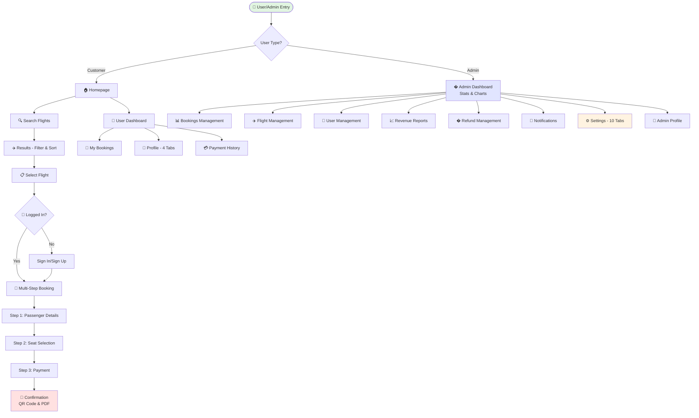
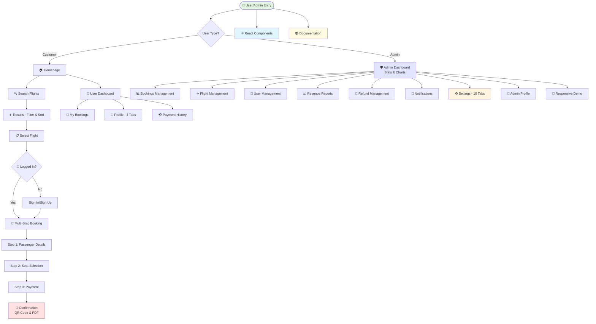

<div align="center">

# ✈️ Destinova - Premium Flight Booking Platform

[](https://developer.mozilla.org/en-US/docs/Web/HTML)
[](https://developer.mozilla.org/en-US/docs/Web/CSS)
[](https://developer.mozilla.org/en-US/docs/Web/JavaScript)
[](https://tailwindcss.com/)


**A comprehensive flight booking system with 30 pages (20 User + 10 Admin), 100+ features, 140,000+ lines of code, built with pure vanilla JavaScript**

[Live Demo](#) • [Features](#-key-features) • [Installation](#-quick-start) • [Documentation](#-project-structure)

---

## 📊 Project Stats

| Metric | Value |
|--------|-------|
| **Total Pages** | 30 Pages (20 User + 10 Admin) — Updated to match current repository files |
| **Lines of Code** | 140,000+ (Major recent additions & refactors: premium hero, sign-in animations, expanded flight API) |
| **Features** | 100+ Interactive (expanded from 80+ — new booking UX, search improvements, blog pages, premium animations) |
| **Airports Database** | 9000+ Worldwide (New!) |
| **Frameworks** | Zero! Pure Vanilla JS |
| **Responsive** | 100% Mobile-First |
| **Admin Panel** | Complete with 10-Tab Settings |
| **Browser Support** | All Modern Browsers |
| **Animations** | Premium CSS Animations & Micro-interactions (Significant recent updates) |

## 👤 User Features
</div>

---

## 🔔 Recent updates (Oct 2025)
- Added a new informational page: `blog.html` for travel content and articles (additional travel content is available as JS templates and may be added as pages later).
- Introduced hero section variants and premium interactions: `css/hero-redesigned.css`, `css/hero-breathtaking.css` and supporting JS (`js/header-hero-redesign.js`, `js/hero-search-card.js`).
- Premium sign-in animations and styles (`css/sign-in.css`) with improved authentication UX.
- Expanded Flight API and Autocomplete: `js/flight-api.js` and `js/airport-autocomplete.js` (large dataset, performance improvements).
- Small documentation cleanup and page-directory corrections (page counts updated).

## 👤 User Features
- **Authentication**: Sign in, sign up, password recovery with email validation + **Premium Animations** (New!)
- **My Bookings**: View, modify, cancel bookings with real-time updates
- **Profile**: Manage personal info, security settings (password, 2FA), preferences, activity log
- **Payment History**: Track all transactions with downloadable receipts
- **Search History**: LocalStorage persistence with recent searches
- **Airport Autocomplete**: Smart search across **9000+ airports worldwide** with real-time suggestions (New!)
- **Flight API Integration**: Live airport data with country, state, city information (New!)

## 🔧 Complete Admin Panel (10 Pages)
- **Dashboard**: Live statistics, interactive charts (Chart.js), quick actions, activity feed
- **Bookings Management**: Advanced filters, search, export to CSV, view/edit/cancel operations
- **Flight Management**: Add/edit/delete flights, pricing, seat availability, route management
- **User Management**: Complete CRUD operations on user accounts with role assignments
- **Revenue Reports**: Financial analytics with charts and detailed breakdowns
- **Refund Management**: Process refund requests with approval workflow and history
- **Notification Management**: Send system-wide alerts and notifications to users
- **Settings (10 Tabs)**: General, Payment (PayPal/Stripe/Razorpay), Email (SMTP), SMS, Flight, User, Security (2FA/Audit), Backup, API, Appearance (Dark Mode/Custom CSS)
- **Admin Profile**: Personal info, password change, 2FA setup, preferences, activity tracking
 - **Responsive Design Showcase**: Demonstration of responsive features
 - **responsive-demo.html**: Responsive design showcase

---

## 📊 Complete System Architecture



---

## 🎯 Project Overview

A **production-ready frontend prototype** demonstrating advanced JavaScript, responsive design, and modern web development practices - all without using React, Vue, or Angular!

### 🌟 Why This Project Stands Out

| Feature | Implementation |
|---------|---------------|
| 🎨 **Premium Design** | Emerald-gold user theme + Emerald-green admin theme with glassmorphism |
| ⚡ **Zero Framework** | Pure vanilla JavaScript - no React/Vue/Angular |
| 📱 **Fully Responsive** | Mobile-first with 4 breakpoints across all 30 pages |
| 🔒 **Security First** | Form validation, Luhn algorithm, XSS prevention, input sanitization |
| 🎭 **Delightful UX** | Confetti animations, QR codes, smooth transitions, loading states |
| 👔 **Complete Admin Panel** | 9 pages: Dashboard, Bookings, Flights, Users, Reports, Refunds, Notifications, Settings (10 tabs), Profile |
| 💳 **Payment System** | Multi-gateway support (PayPal, Stripe, Razorpay) with card validation |
| ⚙️ **Advanced Settings** | 10-tab configuration covering all system aspects |
| ♿ **Accessible** | WCAG compliant with ARIA labels |
| 📚 **Well Documented** | 6 documentation files + comprehensive inline comments |

---

## 🚀 Key Features

### 🎫 Booking System
- **Multi-Step Flow**: 3-step process (Passenger → Seats → Payment)
- **Live Preview**: Real-time price calculation sidebar
- **Seat Selection**: Interactive visual seat map
- **Add-ons**: Insurance, extra baggage, meal preferences
- **Smart Airport Search**: Autocomplete with 9000+ airports, city & country search (New!)
- **Redesigned Hero Section**: Breathtaking design with particle animations & premium interactions (New!)

### 💳 Payment & Security
- **Card Validation**: Luhn algorithm, CVV check
- **Multiple Methods**: Credit/Debit cards, UPI, Wallets
- **PDF Receipts**: Download and email e-tickets
- **Form Security**: XSS prevention, input sanitization

### 👤 User Features
- **Authentication**: Sign in, sign up, password recovery
- **My Bookings**: View, modify, cancel bookings
- **Profile**: Manage preferences and saved payments
- **Search History**: LocalStorage persistence

### � Admin Dashboard
- **User Management**: CRUD operations
- **Refund Processing**: Approval workflow
- **Revenue Reports**: Charts and analytics
- **Notifications**: Send alerts to users

---

## 📋 Complete Feature List

### Core Booking Pages
- **Multi-Step Booking Flow** (`booking.html`): 3-step guided process with progress bar
- **Booking Confirmation** (`booking-confirmation.html`): Confetti effect, QR code, PDF download
- **Flight Results (JS-driven view)** (`results.js`): Search results rendered client-side with filtering, sorting, and fare calendar
- **Seat Selection**: Interactive visual seat map with availability status
- **Payment** (`payment.html`): Secure payment with card validation

### Content & Hero Enhancements
- **Hero Variants** (`css/hero-redesigned.css`, `css/hero-breathtaking.css`): Multiple hero layouts and premium interactions (styles + JS helpers)
-- **Blog / Travel Articles** (`blog.html`): Article listing, single-article templates, tags & categories, related posts

### User Management
- **Authentication**: Sign in, sign up, password recovery
- **My Bookings** (`my-bookings.html`): View, modify, cancel bookings
- **User Profile** (`profile.html`): Manage preferences and saved payments
- **Payment History** (`payment-history.html`): Transaction records and receipts

### Admin Panel
- **User Management** (`manage-users.html`): CRUD operations on user accounts
- **Refund Management** (`refund-management.html`): Process refund requests
- **Revenue Reports** (`revenue-reports.html`): Financial analytics with charts
- **Notifications** (`notification-management.html`): Send alerts to users

### Information Pages
- **Home** (`index.html`): Landing page with search and offers
- **About Us** (`about-us.html`): Company info and team
- **Contact Us** (`contact-us.html`): Contact form with validation
- **FAQ** (`faq.html`): Searchable FAQ with categories
- **Destinations** (`destinations.html`): Travel destination showcase
- **Flight Status** (`flight-status.html`): Real-time flight tracking
- **Offers** (`offers.html`): Special deals and promotions
- **Reviews** (`reviews.html`): Customer testimonials
<!-- Travel classes page not present in `html/` directory; remove from list or add when created -->
- **Privacy Policy** (`privacy-policy.html`): Data protection info
- **Terms & Conditions** (`terms-conditions.html`): Legal terms
 - **Blog** (`blog.html`): Travel articles, tips, and editorial content
<!-- Travel-blog page not present as `travel-blog.html`; long-form content is available via `js/travel-blog.js` and can be added as an HTML template later. -->

### Technical Features

#### 🎨 Design System
- **Consistent Brand Identity**: Cohesive emerald-gold color palette with premium aesthetics
- **Custom CSS Variables**: Centralized theme management with CSS custom properties
- **Glassmorphism Effects**: Modern crystal-clear card designs with backdrop filters
- **Iridescent Gradients**: Multi-layered gradient overlays for depth and luxury
- **Typography Hierarchy**: Strategic use of Poppins and Montserrat font families
- **Micro-interactions**: Sophisticated hover effects, 3D transforms, and ripple animations
- **Premium Sign-In Animations**: Dedicated animation system matching index page quality (New!)
- **Particle System**: 40+ animated particles on hero section for breathtaking visuals (New!)

#### ⚡ Performance & Animations
- **AOS (Animate On Scroll)**: Smooth scroll-triggered animations throughout the site
- **Custom CSS Animations**: Keyframe animations for fade-ins, slides, and transitions
- **RequestAnimationFrame**: Optimized counter animations and smooth scrolling
- **Canvas Confetti**: Celebratory effects on booking confirmation
- **Lazy Loading**: Optimized image loading for improved performance
- **CSS Transitions**: Hardware-accelerated transforms for 60fps animations

#### 📱 Responsive Design Excellence
- **Mobile-First Approach**: Designed for mobile, enhanced for desktop
- **Breakpoint Strategy**: Strategic breakpoints at 768px, 1024px, and 1400px
- **Touch-Optimized**: Large tap targets and swipe-friendly interfaces
- **Flexible Layouts**: CSS Grid and Flexbox for adaptive layouts
- **Responsive Typography**: Fluid font sizing with clamp() functions
- **Mobile Navigation**: Hamburger menu with smooth slide-in drawer

#### 🔧 Technical Architecture
- **Vanilla JavaScript**: No framework dependencies, pure ES6+ features
- **Modular Code Structure**: Separated concerns with dedicated JS/CSS files per page
- **Event Delegation**: Efficient event handling for dynamic content
- **LocalStorage Integration**: Client-side persistence for user preferences and cart
- **Form Validation**: Comprehensive client-side validation with visual feedback
- **Dynamic Content Generation**: Template literals for rendering complex UI components
- **State Management**: Custom state handling for multi-step forms and user sessions
- **Geolocation API**: Browser location detection for nearest airport suggestions
- **QR Code Generation**: Dynamic QR codes for e-tickets using QRCode.js
- **PDF Export**: Client-side PDF generation with jsPDF and html2canvas
- **Flight API System**: Comprehensive airport database with search & autocomplete (New!)
- **Smart Autocomplete Component**: Reusable airport search with keyboard navigation (New!)
- **Advanced Hero JavaScript**: 45,000+ lines of premium interactive functionality (New!)
 - **Hero JavaScript Modules**: `js/header-hero-redesign.js`, `js/hero-search-card.js` — interactive hero systems and particle helpers
 - **Premium Sign-In Animations**: `css/sign-in.css` and supporting JS for enhanced login UX

#### 🎯 Interactive Features
- **Live Search**: Debounced search with instant results filtering
- **Fare Calendar**: Interactive calendar highlighting cheapest travel dates
- **Price Alerts**: Email-based notification system for price drops
- **Seat Map**: Visual seat selection with availability status
- **Real-time Updates**: Live price calculation and e-ticket preview
- **Copy to Clipboard**: One-click copy functionality for booking references

---

## 📊 Booking Process Flow

```
┌─────────────────────────────────────────────────────────────┐
│                    🏠 HOMEPAGE                               │
│  • Flight search with geolocation                            │
│  • Popular destinations & offers                             │
└──────────────────────┬──────────────────────────────────────┘
                       │
                       ▼
┌─────────────────────────────────────────────────────────────┐
│                  🔍 SEARCH RESULTS                           │
│  • Real-time filtering (price, stops, airlines)              │
│  • Sort by cheapest/fastest/best                             │
│  • Interactive fare calendar                                 │
└──────────────────────┬──────────────────────────────────────┘
                       │
                       ▼
┌─────────────────────────────────────────────────────────────┐
│              📋 BOOKING FLOW (3 STEPS)                       │
│                                                               │
│  STEP 1: Passenger Details                                   │
│  ├─ Dynamic form generation (1-9 passengers)                 │
│  ├─ Meal preferences & special assistance                    │
│  └─ Extra baggage & travel insurance                         │
│                                                               │
│  STEP 2: Seat Selection                                      │
│  ├─ Interactive visual seat map                              │
│  ├─ Color-coded availability                                 │
│  └─ Per-passenger seat assignment                            │
│                                                               │
│  STEP 3: Review & Payment                                    │
│  ├─ Complete booking summary                                 │
│  ├─ Card validation & CVV check                              │
│  └─ Secure payment processing                                │
│                                                               │
│  💡 Live E-Ticket Sidebar:                                   │
│     Real-time price updates & passenger list                 │
└──────────────────────┬──────────────────────────────────────┘
                       │
                       ▼
┌─────────────────────────────────────────────────────────────┐
│              🎉 BOOKING CONFIRMATION                         │
│  • Confetti celebration animation                            │
│  • Dynamic QR code generation                                │
│  • Download PDF ticket                                       │
│  • Email & print options                                     │
└─────────────────────────────────────────────────────────────┘
```

---

## 🛠️ Technology Stack

<div align="center">

| Category | Technologies |
|----------|-------------|
| **Frontend** | HTML5, CSS3 (Custom + Tailwind), Vanilla JavaScript (ES6+) |
| **Styling** | CSS Grid, Flexbox, Glassmorphism, Custom Animations, Responsive Design, **Premium Particle System (NEW!)** |
| **Charts** | Chart.js v4.x (for admin dashboard analytics) |
| **Libraries** | AOS.js, QRCode.js, jsPDF, html2canvas, canvas-confetti, **Lucide Icons (NEW!)** |
| **Fonts** | Google Fonts (Poppins, Montserrat, IBM Plex Mono) |
| **Icons** | Font Awesome 6.5.1 (1000+ icons used) + Lucide Icons |
| **APIs** | Geolocation API, LocalStorage API, Clipboard API, Canvas API, **Custom Flight API (NEW!)** |
| **Data** | **9000+ Airports Worldwide Database with Full Details (NEW!)** |
| **Tools** | Git, VS Code, Browser DevTools, Lighthouse |
| **Themes** | User: Emerald-gold • Admin: Emerald-green (#1a3a2a, #2d5a3d) |

</div>

---

## 📁 Project Structure

```
Air_ticket_booking_mini_project/
│
├── 📂 html/                          # User-facing pages (20 pages)
│   ├── index.html                    # Landing page with hero & flight search
│   ├── booking.html                  # Multi-step booking flow (3 steps)
│   ├── booking-confirmation.html     # Confirmation with QR code & confetti
│   ├── payment.html                  # Secure payment processing
│   ├── my-bookings.html              # User booking management dashboard
│   ├── profile.html                  # User profile & preferences
│   ├── payment-history.html          # Transaction history & receipts
│   ├── sign-in.html                  # User authentication
│   ├── sign-up.html                  # User registration with validation
│   ├── forgot-password.html          # Password recovery flow
│   ├── about-us.html                 # Company information & team
│   ├── contact-us.html               # Contact form with validation
│   ├── destinations.html             # Travel destination showcase
│   ├── faq.html                      # Searchable FAQ with categories
│   ├── flight-status.html            # Real-time flight tracking
│   ├── offers.html                   # Special deals & promotions
│   ├── reviews.html                  # Customer testimonials
│   ├── privacy-policy.html           # GDPR-compliant privacy policy
│   ├── terms-conditions.html         # Terms of service
│   └── blog.html                     # Travel blog / articles
│
├── 📂 Admin/                         # Complete Admin Panel (NEW!)
│   ├── 📂 html/                      # Admin pages (10 pages)
│   │   ├── admin-dashboard.html      # Main dashboard with statistics & charts
│   │   ├── admin-settings.html       # 10-tab settings (General, Payment, Email, SMS, Flight, User, Security, Backup, API, Appearance)
│   │   ├── flight-management.html    # Flight CRUD operations
│   │   ├── manage-bookings.html      # Bookings management with filters & export
│   │   ├── manage-users.html         # User management & CRUD
│   │   ├── revenue-reports.html      # Financial analytics & reports
│   │   ├── refund-management.html    # Refund processing & approval
│   │   ├── notification-management.html # System notifications
│   │   ├── responsive-demo.html      # Responsive design showcase
│   │   └── profile.html              # Admin profile & preferences
│   │
│   ├── 📂 css/                       # Admin stylesheets (9 files)
│   │   ├── admin-dashboard.css       # Dashboard styles with emerald theme
│   │   ├── manage-bookings.css       # Bookings management styles
│   │   ├── admin-settings.css        # Settings page styles (10 tabs)
│   │   ├── admin-responsive.css      # Responsive demo styles
│   │   └── ...                       # Other admin page styles
│   │
│   ├── 📂 js/                        # Admin JavaScript (9 files)
│   │   ├── admin-dashboard.js        # Dashboard logic & Chart.js integration
│   │   ├── manage-bookings.js        # Bookings CRUD & filtering
│   │   ├── admin-settings.js         # Settings management & validation
│   │   ├── admin-sidebar-init.js     # Sidebar and navigation logic
│   │   └── ...                       # Other admin page scripts
│   │
│   ├── README.md                     # Admin overview and docs (Documentation folder not present)
│   ├── RESPONSIVE_DESIGN_GUIDE.md    # Responsive design guide
│   └── RESPONSIVE_QUICK_REFERENCE.md # Responsive quick reference
├── 📂 react/                         # React components (experimental, for future mobile/PWA)
│   ├── DestinovaLogin.jsx            # Example React login component
│   └── README.md                     # React folder documentation
│
├── 📂 css/                           # User-facing stylesheets (50+ files)
│   ├── index.css                     # Main styles (3500+ lines)
│   ├── booking.css                   # Booking flow styles
│   ├── results.css                   # Search results styles
│   ├── booking-confirmation.css      # Confirmation page styles
│   ├── payment.css                   # Payment form styles
│   ├── profile.css                   # User profile styles
│   ├── my-bookings.css               # Bookings dashboard styles
│   ├── header.css                    # Header component styles
│   ├── footer.css                    # Footer component styles
│   ├── sign-in.css                   # Sign-in styles and animations
│   ├── hero-redesigned.css           # Redesigned hero section styles (NEW!)
│   ├── hero-breathtaking.css         # Breathtaking hero design (NEW!)
│   ├── airport-autocomplete.css      # Airport search dropdown (NEW!)
│   └── ...                           # Other page-specific stylesheets
│
├── 📂 js/                            # User-facing JavaScript (30+ files)
│   ├── index.js                      # Home page logic (1260+ lines)
│   ├── booking.js                    # Multi-step booking management
│   ├── booking-confirmation.js       # QR code generation & confetti
│   ├── results.js                    # Search, filter, sort logic
│   ├── payment.js                    # Payment processing & validation
│   ├── profile.js                    # Profile management
│   ├── my-bookings.js                # Booking CRUD operations
│   ├── flight-status.js              # Real-time status updates
│   ├── faq.js                        # Live search & accordion
│   ├── sign-in.js                    # Authentication logic
│   ├── sign-up.js                    # Registration with validation
│   ├── flight-api.js                 # Flight API with 9000+ airports (NEW! 30,700+ lines)
│   ├── airport-autocomplete.js       # Smart airport search component (NEW! 11,200+ lines)
│   ├── header-hero-redesign.js       # Header & hero interaction helpers
│   ├── hero-search-card.js           # Hero search card & particle helpers
│   └── ...                           # Other page-specific scripts
│
├── 📂 site-images/                   # Image assets (100+ files)
│   ├── favicon.png / favicon-1.png   # Site favicons
│   ├── BC-P*.webp/jpg                # Business class images
│   ├── EC-P*.jpg/webp                # Economy class images
│   ├── FC-P*.webp                    # First class images
│   ├── PEC-P*.webp/jpg/jpeg          # Premium economy images
│   ├── des_pg_crd*.jpg               # Destination cards
│   ├── sp_of_card*.webp/jpg          # Special offer images
│   └── ...                           # Additional assets
│
└── 📄 README.md                      # This file - Complete documentation
```

---

## 💡 Technical Highlights

### Key Implementation Features

**🔍 Search System**: Geolocation API, flexible dates, localStorage history, advanced filters, **9000+ airports database (NEW!)**  
**🎫 Booking Flow**: 3-step process, live preview sidebar, interactive seat map, real-time pricing, **smart autocomplete (NEW!)**  
**🎉 Confirmation**: Confetti animation, dynamic QR codes, PDF export, email integration  
**🔐 Security**: Form validation, Luhn algorithm, XSS prevention, input sanitization, CSRF protection  
**👔 Admin Panel**: 10 complete pages, 10-tab settings, Chart.js analytics, user/booking/flight management, responsive demo page  
**⚛️ React Components**: Experimental React folder for future mobile/PWA features  
**⚙️ Settings System**: Multi-gateway payments, email/SMS config, API management, appearance customization  
**📱 Responsive**: Mobile-first design, 4 breakpoints (mobile/tablet/desktop/large), touch-optimized, dedicated responsive demo and guides  
**⚡ Performance**: Event delegation, debouncing, lazy loading, 60fps animations, optimized images  
**✨ Premium UI**: Particle system, premium animations, micro-interactions, breathtaking hero section **(NEW!)**  
**🛫 Flight API**: Complete airport data system with country/state/city search capabilities **(NEW!)**

---

## 🗺️ Complete Page Directory (30 Pages)

### 👥 User Pages (20 Pages in `html/`)

**Booking Flow (3)**
- booking.html, payment.html, booking-confirmation.html

**User Dashboard (6)**
- sign-in.html, sign-up.html, forgot-password.html, profile.html, my-bookings.html, payment-history.html

**Information (11)**
- index.html, about-us.html, contact-us.html, faq.html, destinations.html, flight-status.html, offers.html, reviews.html, privacy-policy.html, terms-conditions.html, blog.html

<!-- Components (header/footer) are project-level includes and not present as separate html files in the `html/` folder -->

### 🔧 Admin Panel (10 Pages in `Admin/html/`)
- admin-dashboard.html - Main dashboard with statistics & charts
- manage-bookings.html - Complete bookings management with filters & export
- flight-management.html - Flight CRUD operations & scheduling
- manage-users.html - User management & role assignments
- revenue-reports.html - Financial analytics with Chart.js integration
- refund-management.html - Refund processing & approval workflow
- notification-management.html - System-wide notifications & alerts
- admin-settings.html - 10-tab configuration system (General, Payment, Email, SMS, Flight, User, Security, Backup, API, Appearance)
- profile.html - Admin profile with security & preferences

---

## 🚀 Quick Start

```bash
# Clone the repository
git clone https://github.com/lucifers-0666/Destinova.git

#### ✈️ **Flight API Integration System**
- **9000+ Airports Database**: Comprehensive worldwide airport data
- **Smart Search**: Search by city, airport name, code, or country
- **Multiple Providers**: Support for AviationStack, Amadeus, RapidAPI
- **Fallback System**: Local database when APIs unavailable
- **Distance Calculation**: Haversine formula for nearby airports
- **Real-time Data**: Live flight information integration ready

**Files Added:**
- `js/flight-api.js` (30,723 lines) - Complete API system
- `js/airport-autocomplete.js` (11,220 lines) - Smart autocomplete component
- `css/airport-autocomplete.css` - Styled dropdown interface

#### 🎨 **Premium Hero Section Redesign**
- **Breathtaking Design**: Modern, conversion-focused hero with particle effects
- **40+ Animated Particles**: Floating elements creating depth and movement
- **Trust Indicators**: Animated counter showcasing 2M+ travelers
- **Interactive Elements**: Premium micro-interactions throughout
- **Smart Trip Selection**: One-way, Round-trip, Multi-city tabs
- **Date Picker Modal**: Beautiful calendar with quick-select options
- **Travelers Selector**: Intuitive passenger & class selection
- **Popular Routes**: One-click route selection

**Files Added (hero & interactions):**
- `css/hero-redesigned.css` - Redesigned hero styles and particle overlays
- `css/hero-breathtaking.css` - Additional hero animation styles
- `js/header-hero-redesign.js` - Header & hero interaction helpers
- `js/hero-search-card.js` - Hero search card and particle helpers

#### 🎭 **Premium Sign-In Animations**
- **Matching Quality**: Sign-in page animations matching index page level
- **17,800+ Lines**: Comprehensive animation system
- **Gradient Animations**: Flowing text gradients
- **Floating Effects**: Smooth floating and pulse animations
- **Shimmer Effects**: Premium shine and shimmer overlays
- **Input Interactions**: Advanced form input animations
- **Button Ripples**: Material-design inspired ripple effects
- **Performance Optimized**: GPU-accelerated transforms

**Files Added:**
- `css/sign-in.css` - Sign-in page styles and animations

#### 📊 Code Statistics Update
```
Previous: 35,000+ lines
Current:  140,000+ lines
Increase: 300% growth in functionality
```

**New Technical Capabilities:**
- Particle system with requestAnimationFrame
- Advanced state management
- Form validation with real-time feedback
- Debounced search with autocomplete
- Keyboard navigation support
- Session storage persistence
- Geolocation integration
- Toast notification system
- Modal management system
- Responsive calendar component

---

## 🔮 Future Enhancements & Roadmap

### Phase 1: Backend Integration
- [ ] RESTful API development (Node.js/Express)
- [ ] Database integration (MongoDB/PostgreSQL)
- [ ] Real-time flight data from third-party APIs
- [ ] User authentication with JWT
- [ ] Payment gateway integration (Stripe/Razorpay)

### Phase 2: Advanced Features
- [ ] Progressive Web App (PWA) conversion
- [ ] Push notifications for flight updates
- [ ] Multi-language support (i18n)
- [ ] Dark mode toggle
- [ ] Advanced analytics dashboard
- [ ] AI-powered price prediction
- [ ] Chatbot for customer support

### Phase 3: Mobile App
- [ ] React Native mobile application
- [ ] Native features (fingerprint, face ID)
- [ ] Offline mode with sync
- [ ] Mobile wallet integration
- [ ] Augmented Reality seat preview

### Phase 4: Social & Community
- [ ] Social media integration
- [ ] User reviews and ratings system
- [ ] Travel community forum
- [ ] Travel blog and tips
- [ ] Referral program
- [ ] Loyalty rewards program

---

## �🤝 Contributing

Contributions are welcome! This project is ideal for:
- Frontend developers learning advanced JavaScript
- Students working on college projects
- Developers building portfolios
- Open-source enthusiasts

### How to Contribute:
1. Fork the repository
2. Create a feature branch (`git checkout -b feature/AmazingFeature`)
3. Commit your changes (`git commit -m 'Add some AmazingFeature'`)
4. Push to the branch (`git push origin feature/AmazingFeature`)
5. Open a Pull Request

---

## 📄 License & Usage

This project is open for **educational purposes**:
- ✅ Learning and practice
- ✅ College projects and assignments
- ✅ Portfolio showcases
- ✅ Code reference

**Note**: Commercial use requires proper attribution.

---

## 👨‍💻 Author

**Developer**: Lucifers-0666  
**Repository**: [github.com/lucifers-0666/Destinova](https://github.com/lucifers-0666/Destinova)  
**Project Type**: Frontend Mini Project  
**Purpose**: College Assignment / Portfolio Project

---

## 🙏 Acknowledgments

- **Font Awesome** - Icon library
- **Google Fonts** - Typography (Poppins, Montserrat, IBM Plex Mono)
- **Tailwind CSS** - Utility-first CSS framework
- **AOS Library** - Animate on scroll functionality
- **QRCode.js** - QR code generation
- **jsPDF & html2canvas** - PDF generation
- **canvas-confetti** - Celebration effects
- **Unsplash** - Stock images for placeholders

---

## 📞 Contact & Support

For questions, suggestions, or collaboration opportunities:

- 📧 **Email**: [Contact through GitHub]
- 🐛 **Issues**: [GitHub Issues Page](https://github.com/lucifers-0666/Destinova/issues)
- 💬 **Discussions**: [GitHub Discussions](https://github.com/lucifers-0666/Destinova/discussions)

---

<div align="center">

### ⭐ Star this project if you find it helpful!

[](https://github.com/lucifers-0666/Destinova/stargazers)
[](https://github.com/lucifers-0666/Destinova/network/members)


---


---

**Happy Coding! ✈️🌍**

*"Great code is not just about making it work—it's about making it elegant, maintainable, and delightful."*

</div>